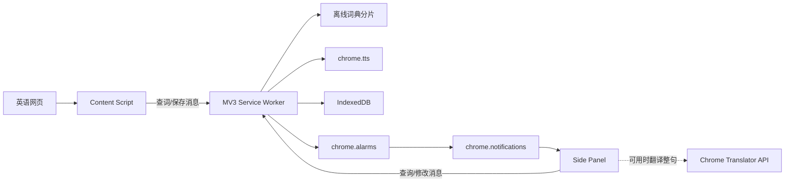

# 英语语境生词 Chrome 插件设计规格

日期：2026-06-30  
状态：待用户审阅  
目标版本：Manifest V3 本地 MVP

## 1. 产品目标

为中文母语用户提供低打断的英语阅读辅助：

1. 用户在英文单词上稳定悬停后，插件显示中文释义并朗读英文单词。
2. 插件自动保存该单词及其所在句子，并在句子中标记目标单词。
3. 插件每周汇总最近一个周期保存的内容，通过 Chrome 系统通知提醒用户。
4. 用户点击通知后，在 Chrome 侧边栏查看和管理周报。

MVP 不需要账号、服务器或第三方翻译服务。生词、句子、来源地址和设置均保存在用户本机，不添加分析、遥测或后台网络请求。

## 2. 设计原则

- **低打断**：查词和保存不要求跳转页面或复制文本。
- **低误触**：只有稳定悬停才触发查词，并允许立即撤销自动保存。
- **本地优先**：离线词典、发音、存储和周报均在浏览器内完成。
- **渐进增强**：Chrome 内置 Translator API 可用于侧边栏整句翻译，但不是核心链路依赖。
- **最小数据**：只保存目标句子及其来源，不保存全文或网页 HTML。
- **可恢复**：Service Worker 被终止或 Chrome 重启后，数据和周报调度仍能恢复。

## 3. MVP 范围

### 3.1 包含

- 普通 HTTP/HTTPS 网页中的英文悬停取词。
- 英文词形规范化、离线英汉释义和音标展示。
- 使用 `chrome.tts` 朗读英文单词。
- 自动保存单词、句子、来源和时间。
- 自动去重、重复遇见次数统计和撤销保存。
- 侧边栏中的本期、全部生词、历史周报和设置。
- 每周 Chrome 系统通知。
- 本地 JSON 导出、导入和全部数据删除。
- 站点停用开关与全局暂停开关。

### 3.2 不包含

- 账号、云同步、邮件、微信或移动端推送。
- OCR、图片文字、Canvas 内容和扫描版 PDF。
- `chrome://`、Chrome Web Store 等禁止扩展注入的页面。
- AI 生成练习题、自动测验和间隔重复算法。
- 远程词典、在线翻译接口和用户自带 API Key。
- Firefox、Safari 和移动端浏览器。

## 4. 关键产品决策

### 4.1 查词触发

鼠标停在可识别英文单词上 500ms 后触发查词。鼠标在等待期间移出单词、页面滚动或窗口失焦时取消。

下列区域不触发：

- `input`、`textarea`、`select`、密码框和可编辑区域。
- `pre`、`code`、脚本、样式和不可见元素。
- 只有单个字母、纯数字、URL、邮箱和明显的程序标识符。

### 4.2 发音

查词成功后默认自动朗读英文单词，不朗读中文释义。设置中可关闭自动朗读，并可调整语速。

新发音开始前停止上一段发音，避免快速移动鼠标时形成语音队列。浮层同时提供手动重播按钮。

### 4.3 自动保存与防污染

释义浮层连续显示 1 秒后自动保存。保存成功后显示 5 秒“撤销”入口。

去重键为：

```text
normalizedLemma + normalizedSentence + sourceOrigin
```

相同去重键再次出现时不创建新记录，只更新：

- `encounterCount`
- `lastSeenAt`
- 最近一次页面标题和 URL

词典未收录时显示“离线词典未收录”，不自动保存；用户可手动保存到“待补充”列表。

### 4.4 周报周期

默认每周一当地时间 09:00 推送，汇总上一个完整自然周（周一 00:00 至下周一 00:00）的记录。用户可修改通知时间，但 MVP 固定周一推送，以避免周报窗口重叠或遗漏。

设备休眠或 Chrome 未运行时不保证准点通知。Chrome 恢复运行后生成尚未生成的最近一期周报并通知一次，不补发重复通知。

## 5. 交互设计

### 5.1 网页浮层

浮层使用独立 Shadow DOM，避免被网站 CSS 影响。内容包括：

- 原词、音标和词性。
- 最多三条中文核心释义。
- 发音按钮。
- 保存状态和撤销入口。
- “在侧边栏查看”入口。

浮层靠近目标单词放置；空间不足时自动翻转。鼠标进入浮层时暂停关闭，移出浮层和目标单词 200ms 后关闭。

### 5.2 侧边栏

侧边栏包含四个视图：

1. **本期**：尚未形成周报的记录，按日期倒序排列。
2. **生词库**：按单词聚合，显示遇见次数和全部例句。
3. **周报**：按周期保存的历史汇总。
4. **设置**：自动发音、语速、通知时间、站点停用、导入导出和删除数据。

每条记录展示：

- 单词、音标、词性和中文释义。
- 使用 `<mark>` 高亮目标词的原句。
- 遇见次数和采集时间。
- 原网页标题与链接。
- 发音、删除和标记“已掌握”操作。

点击系统通知后打开侧边栏，并直接定位到对应周报。

## 6. 技术架构



### 6.1 Content Script

职责：

- 监听和节流鼠标移动事件。
- 根据鼠标坐标定位文本节点和单词边界。
- 提取目标单词及其所在句子。
- 渲染浮层和高亮。
- 将查词、保存、撤销请求发送给 Service Worker。

Content Script 不直接访问 IndexedDB，不加载完整词典，也不执行网络请求。

### 6.2 Service Worker

职责：

- 作为所有数据写入和业务规则的唯一入口。
- 管理词典查询、词形规范化和内存缓存。
- 调用 `chrome.tts`。
- 管理 IndexedDB 事务。
- 创建、检查和恢复每周 Alarm。
- 生成周报并发送系统通知。
- 响应侧边栏的查询和修改消息。

所有事件处理器在模块顶层同步注册。业务状态不能只放在全局变量中，因为 Manifest V3 Service Worker 可随时终止；内存只用于可丢弃的词典分片缓存。

### 6.3 离线词典

词典数据必须满足可再分发许可，并在发布前保留许可证和来源说明。

构建阶段将词典转换为按单词前缀划分的只读 JSON 或二进制分片。运行时只加载命中分片，并在 Service Worker 生命周期内缓存最近使用的分片。

词典条目最少包含：

```ts
interface DictionaryEntry {
  lemma: string;
  phonetic?: string;
  partOfSpeech?: string[];
  definitionsZh: string[];
  inflections?: Record<string, string>;
  frequencyRank?: number;
}
```

词形查找顺序：

1. 精确匹配原词小写形式。
2. 根据词典内置词形映射还原 lemma。
3. 使用受控规则处理复数、第三人称、过去式和进行时。
4. 未命中时返回明确的 `not_found`，不猜测释义。

### 6.4 Chrome Translator API

Translator API 仅用于侧边栏中的“翻译整句”按钮，并采用能力检测。API 不可用、语言包尚未下载或翻译失败时，侧边栏仍完整展示离线词典释义和原句。

它不放在 Service Worker 中，也不参与悬停查词的成功判定。

### 6.5 Side Panel

侧边栏是独立扩展页面，通过消息调用 Service Worker。它不直接修改网页，也不持有业务规则。

为保持 MVP 简单，侧边栏采用单页界面，但各视图、数据访问层和展示组件保持独立，避免将所有逻辑写入一个文件。

## 7. 数据模型

### 7.1 IndexedDB

数据库名称：`context-vocabulary`

#### `captures`

```ts
interface Capture {
  id: string;
  surfaceWord: string;
  normalizedWord: string;
  lemma: string;
  phonetic?: string;
  partOfSpeech?: string[];
  definitionsZh: string[];
  sentence: string;
  wordStart: number;
  wordEnd: number;
  sourceTitle: string;
  sourceUrl: string;
  sourceOrigin: string;
  createdAt: number;
  lastSeenAt: number;
  encounterCount: number;
  mastered: boolean;
  lookupStatus: "found" | "not_found";
  dedupeKey: string;
}
```

索引：

- `dedupeKey`：唯一索引。
- `createdAt`：生成周报和时间排序。
- `lemma`：生词聚合。
- `mastered`：筛选掌握状态。

#### `digests`

```ts
interface WeeklyDigest {
  id: string;
  periodStart: number;
  periodEnd: number;
  generatedAt: number;
  captureIds: string[];
  wordCount: number;
  sentenceCount: number;
  notificationShownAt?: number;
}
```

`periodStart + periodEnd` 构成唯一周期，防止重复生成。

### 7.2 `chrome.storage.local`

只保存小型配置：

```ts
interface Settings {
  enabled: boolean;
  autoSpeak: boolean;
  speechRate: number;
  saveSource: boolean;
  notificationHour: number;
  notificationMinute: number;
  disabledOrigins: string[];
  hostPermissionOnboardingComplete: boolean;
  schemaVersion: number;
}
```

## 8. 消息契约

消息必须使用可判别联合类型，不接受任意字符串命令。

```ts
type ExtensionRequest =
  | { type: "LOOKUP_WORD"; word: string }
  | { type: "SPEAK_WORD"; word: string }
  | { type: "SAVE_CAPTURE"; payload: SaveCaptureInput }
  | { type: "UNDO_CAPTURE"; captureId: string }
  | { type: "LIST_CAPTURES"; filter: CaptureFilter }
  | { type: "UPDATE_CAPTURE"; id: string; mastered?: boolean }
  | { type: "DELETE_CAPTURE"; id: string }
  | { type: "GET_DIGEST"; digestId: string }
  | { type: "EXPORT_DATA" }
  | { type: "IMPORT_DATA"; payload: ExportPayload };
```

Service Worker 对每个请求校验来源、字段长度和类型。保存时重新计算句子偏移和去重键，不能信任 Content Script 提供的派生值。

## 9. 权限设计

必需权限：

```json
[
  "storage",
  "alarms",
  "notifications",
  "tts",
  "sidePanel",
  "scripting"
]
```

站点访问使用：

```json
{
  "optional_host_permissions": [
    "http://*/*",
    "https://*/*"
  ]
}
```

首次启用时解释读取网页文本的用途，再由用户主动授予站点权限。授予后动态注册 Content Script，并配置 `allFrames: true` 以覆盖已授权 iframe。拒绝权限时，插件仍可打开侧边栏和设置，但不能在网页取词。

请求全站权限是核心功能需要，不能用于采集浏览历史、全文或无关页面数据。

## 10. 隐私与安全

- 插件不发送网络请求，不包含分析、广告或遥测 SDK。
- 不读取或保存表单、密码框、可编辑区域和网页存储。
- 只保存用户稳定悬停并成功触发的目标句子。
- 句子作为纯文本保存；渲染高亮时使用 DOM 节点和 `textContent`，不使用原始 HTML。
- 来源 URL 仅用于用户返回原文，可在设置中关闭保存来源。
- 导入文件执行版本、结构、数量和字段长度校验。
- “删除全部数据”同时清空 captures、digests、设置和缓存。
- 隐私政策明确说明本地保存的网站内容、使用目的和不共享承诺。
- Manifest V3 包内不包含远程执行代码。

## 11. 调度与通知

安装、浏览器启动和 Service Worker 启动时执行幂等的 `ensureWeeklyAlarm()`：

1. 读取当前通知设置。
2. 查询名为 `weekly-digest` 的 Alarm。
3. Alarm 不存在或时间配置已变化时重新创建。
4. 检查上一个自然周是否已有 digest。
5. 如有缺失则生成一次，避免重复通知。

Alarm 触发后：

1. 计算上一个自然周边界。
2. 按 `createdAt` 查询 captures。
3. 按 lemma 聚合并生成 digest。
4. 无记录时不发送系统通知，但保存空周期标记，防止重复检查。
5. 有记录时发送通知，并记录 `notificationShownAt`。

通知点击事件设置待打开的 digest ID，并打开对应侧边栏页面。

## 12. 异常处理

- **无法定位文本**：静默忽略，不显示错误。
- **词典未命中**：显示未收录状态，允许手动保存。
- **TTS 不可用**：保留释义展示，发音按钮显示不可用。
- **IndexedDB 写入失败**：浮层显示“保存失败，可重试”，不得伪装成功。
- **句子偏移不一致**：重新搜索目标单词；仍不一致则拒绝保存。
- **页面卸载**：取消待执行的悬停和自动保存任务。
- **权限被撤销**：注销相关 Content Script，并在侧边栏提示重新授权。
- **数据版本不兼容**：中止导入或迁移，不覆盖现有数据。
- **Alarm 重复触发**：依靠周期唯一键保证幂等。

## 13. 测试策略

### 13.1 单元测试

- 英文单词边界、撇号、连字符和标点处理。
- 词形还原及规则回退。
- 句子切分和目标词偏移。
- 去重键和重复遇见计数。
- 周边界、时区和夏令时计算。
- 周报幂等生成。
- 导入数据校验。

### 13.2 集成测试

- Content Script 与 Service Worker 消息契约。
- Service Worker 重启后的查词和保存。
- IndexedDB 事务失败处理。
- Alarm 丢失后的自动恢复。
- 通知点击到指定周报的导航。
- 权限授予和撤销。

### 13.3 浏览器端到端测试

通过加载未打包扩展验证：

- 新闻文章、博客、文档和动态加载页面。
- 深层嵌套元素、Shadow DOM 和跨 iframe 场景。
- 网站 CSS 不影响浮层，浮层 CSS 不污染网站。
- 快速移动、滚动和切换标签不会误保存。
- 浏览器重启后记录和调度仍存在。
- 开启网络监控时没有插件发起的业务网络请求。

### 13.4 手工兼容矩阵

- macOS、Windows。
- 当前 Chrome 稳定版和前一个稳定版。
- 浅色、深色主题。
- 100%、125%、150% 页面缩放。
- 中文、英文系统 TTS 声音组合。

## 14. 验收标准

1. 在标准 HTML 英语文章中，稳定悬停可正确识别常规英文单词和所在句子。
2. 查词成功后展示离线中文释义，并能通过系统 TTS 发音。
3. 自动保存不会为同一来源的相同单词和句子创建重复记录。
4. 保存记录中的目标词在浮层和侧边栏中均准确高亮。
5. 用户可在 5 秒内撤销自动保存，也可在侧边栏删除记录。
6. 每周周报只生成一次；错过调度后在 Chrome 恢复运行时补生成一次。
7. 点击系统通知可到达对应侧边栏周报。
8. 浏览器重启和 Service Worker 终止不会造成已保存数据丢失。
9. 用户可导出、导入和删除全部本地数据。
10. 在未启用 Translator API 时，所有核心功能仍正常运行。
11. 插件不读取表单内容，不保存网页 HTML，不发送业务网络请求。
12. 发布包包含词典数据的来源与再分发许可说明。

## 15. 实施顺序

1. 建立 Manifest V3 骨架、权限和消息类型。
2. 实现网页取词、断句和 Shadow DOM 浮层。
3. 构建离线词典分片和查询引擎。
4. 接入 TTS、自动保存、撤销和 IndexedDB。
5. 实现侧边栏生词库和设置。
6. 实现周报、Alarm 和系统通知。
7. 加入导入导出、隐私页、自动化测试和上架检查。

实现阶段应先验证“在真实文章网页上稳定取词”这一最高风险链路，再扩展周报和管理界面。
